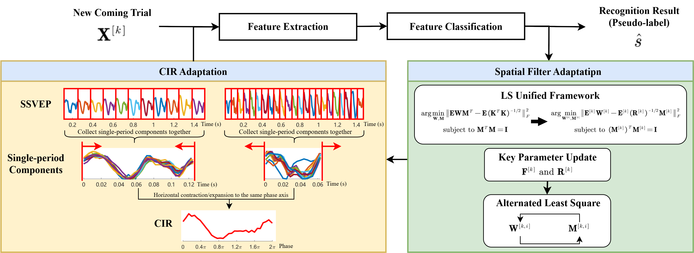
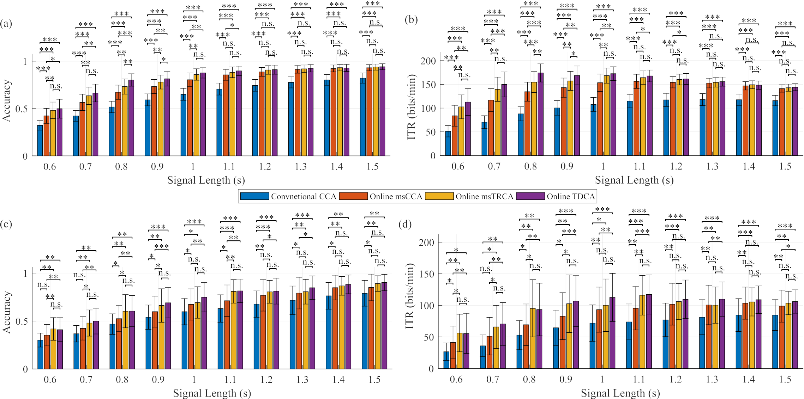
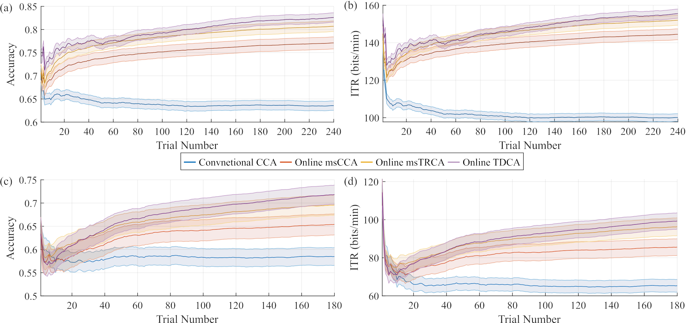

# Unified Online Adaptation Framework for CA-based SSVEP Spatial Filtering Methods

This repository contains the MATLAB implementation of the unified online adaptation framework proposed in the paper:

> **Ze Wang, Lu Shen, Xinran Mi, Leqian Cheng, Yi Yang, Boyu Wang, Tzyy-Ping Jung, Feng Wan**, "Unified Online Adaptation Framework for Correlation Analysis-based Spatial Filtering Methods in SSVEP-based BCIs," *IEEE Journal of Biomedical and Health Informatics * (Accepted).

## Brief Introduction

Steady-state visual evoked potential (SSVEP)-based brain-computer interfaces (BCIs) require calibration data to train spatial filtering methods, which is laborious and time-consuming. To achieve calibration-free recognition, this study proposes a **unified online adaptation framework** for correlation analysis (CA)-based spatial filtering methods.

The framework consists of two core components:

1. **Spatial Filter Online Adaptation**: By extending the least-squares (LS) unified framework from calibration-based to online scenarios, spatial filters can be continuously updated trial-by-trial using only pseudo-labels.

2. **Cross-Stimulus Transfer via Common Impulse Response (CIR)**: Inspired by stimulus-stimulus transfer methods, we assume SSVEP signals of different stimuli share a common impulse response. The CIR is online adapted to generate user-specific SSVEP templates for all stimuli, enabling full utilization of spatial filters even when some stimuli have no recorded trials.

Following this framework, three advanced spatial filtering methods are extended to their online versions:

- **Online msCCA**: Online multi-stimulus canonical correlation analysis.
- **Online msTRCA**: Online multi-stimulus task-related component analysis.
- **Online TDCA**: Online task-discriminant component analysis.

### Framework Overview




> **Figure 1**: Flowchart of the unified online adaptation framework. For each incoming trial, the EEG signal is first recognized using spatial filters and CIRs obtained from previous trials. The recognition result is then used as a pseudo-label to update the spatial filters and CIRs for the next trial.

## Dependencies

- **MATLAB** (verified on MATLAB R2022a and later versions)
- **Statistics and Machine Learning Toolbox** (for `canoncorr`)
- **Signal Processing Toolbox** (for `filtfilt`, `cheby1`, `cheb1ord`, `iircomb`, `square`)

## Dataset

The simulations are conducted on two public SSVEP datasets:

1. **Benchmark Dataset** [1]: 35 subjects, 40 stimuli (8.0–15.8 Hz, 0.2 Hz step), 6 blocks, 250 Hz sampling rate.
2. **UCSD Dataset** [2]: 10 subjects, 12 stimuli (9.25–14.75 Hz, 0.5 Hz step), 15 blocks, 256 Hz sampling rate.

> **Note**: Due to data-sharing policies, the EEG datasets are **not included** in this repository. Please download them from the official sources:
> - Benchmark Dataset: http://bci.med.tsinghua.edu.cn/download.html
> - UCSD Dataset: https://sccn.ucsd.edu/~msmakeig/12FFM_SSVEP.html

After downloading, place the data files in the following structure:

```
data/
├── Freq_Phase.mat          % Stimulus frequencies and phases
├── S1.mat ~ S35.mat        % Raw EEG data (Benchmark Dataset)
└── filtered_data/          % Generated by filter_benchmark.m
    ├── Freq_Phase.mat
    └── S1.mat ~ S35.mat
```

## How to Run Simulations

### Step 1: Data Preprocessing

Run `filter_benchmark.m` to apply notch filtering and filter bank decomposition to the raw EEG data:

```matlab
filter_benchmark
```

This script will:
- Load raw EEG data from `data/`
- Apply a 50 Hz notch filter and 5 subband Chebyshev Type I filters
- Save preprocessed data to `data/filtered_data/`

### Step 2: Run Online Adaptation Simulations

Run the test scripts for each online method:

```matlab
test_online_mscca       % Online msCCA simulation
test_online_mstrca      % Online msTRCA simulation
test_online_tdca        % Online TDCA simulation
```

Each script performs 20 independent runs of online adaptation. In each run:
1. All trials are randomly shuffled to simulate an online scenario.
2. For each incoming trial, the signal is recognized using spatial filters and CIRs from previous trials.
3. The recognition result (pseudo-label) is used to update spatial filters and CIRs.
4. Recognition accuracy and ITR are computed cumulatively across trials.

Results will be saved in:
- `test_online_mscca_res/`
- `test_online_mstrca_res/`
- `test_online_tdca_res/`

> **Note**: The simulations may take a long time (several hours) depending on your hardware. The online TDCA simulation is the most computationally intensive due to signal augmentation.

## Simulation Results

### Recognition Performance Across All Trials




> **Figure 2**: Recognition performance of the conventional CCA and three proposed online adaptation methods across all trials with different signal lengths. (a)-(b) Benchmark Dataset; (c)-(d) UCSD Dataset.

### Online Adaptation Performance




> **Figure 3**: Online recognition performance across trials. (a)-(b) Benchmark Dataset; (c)-(d) UCSD Dataset.


## Citation

If you use this code in your research, please cite:

```bibtex
@article{wang_unified_2025,
  title={Unified Online Adaptation Framework for Correlation Analysis-based Spatial Filtering Methods in {SSVEP}-based {BCIs}},
  author={Wang, Ze and Shen, Lu and Mi, Xinran and Cheng, Leqian and Yang, Yi and Wang, Boyu and Jung, Tzyy-Ping and Wan, Feng},
  journal={IEEE Journal of Biomedical and Health Informatics},
  year={2025},
  note={Accepted}
}
```

## References

[1] Y. Wang, X. Chen, X. Gao, and S. Gao, "A benchmark dataset for SSVEP-based brain-computer interfaces," *IEEE Trans. Neural Syst. Rehabil. Eng.*, vol. 25, no. 10, pp. 1746–1752, 2017.

[2] M. Nakanishi, Y. Wang, Y.-T. Wang, Y. Mitsukura, and T.-P. Jung, "A high-speed brain speller using steady-state visual evoked potentials," *Int. J. Neur. Syst.*, vol. 24, no. 06, p. 1450019, 2014.

## License

This project is licensed under the MIT License.
